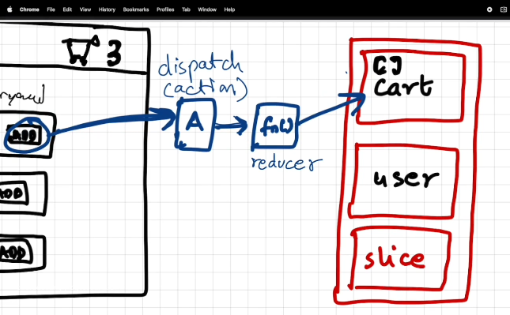
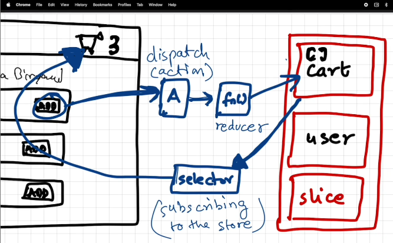
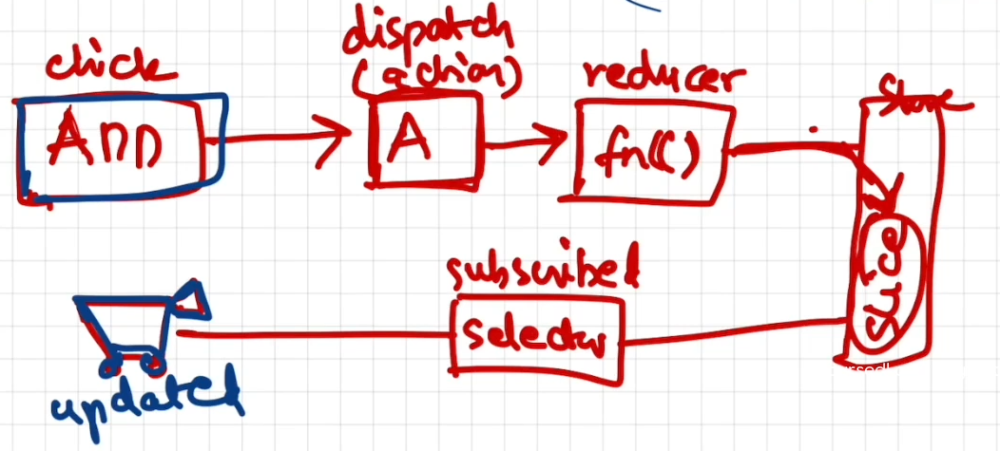
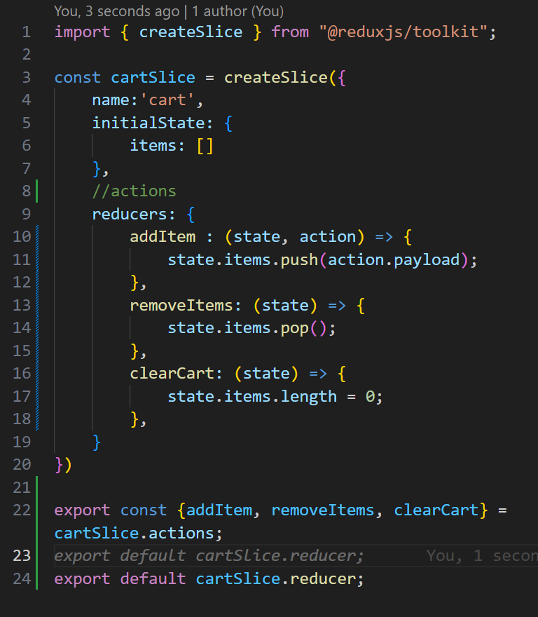

# REDUX TOOLKIT

## Writing Data

- this is `not mandatory`.
- just like this `redux` there is another `justand` like thing to use.
- `redux` helps easy debugging.
- `react-redux` is older version of writing redux `(vanila redux)`.
- `react-toolkit` is newer version of writing redux `(RTK Query)`.
- it having part of the redux store, and it is known as `slices`.
- just suppose we have one button and we clicked on it and it `dispatches` an `action` and this `action will call the function` and it will modify the `slice`. 
- and this function is known as `reducer`.

## Getting Data

- here we use something known as `selector`.
- this phenomena is known as `subscribing to the store`. 
- Workflow 

### WorkFlow

- Install `@reduxjs/toolkit` and `react-redux`.
- Build our store.
- Connect our store to our app.
- `Slice (cartSlice)`.
- `dispatch(action)`.
- Selector.

- importing `configure Store` from `react-redux` in `appStore.js`.
- importing `Provider` from `react-redux` in `app.jsx`.
- added `Provider` Component with `appStore` as a `prop`.
- importing `createSlice` from `react-redux` in the `cartSlice.js` file.
- added `cartSlice` to the store.
- that `createSlice` contains `name` of the store, `initialState` that will contains some object and some `reducers` that will contain `reducer function`.
- In `reducer function` it `includes` two props named `state,action`.
- Here is the Screenshot you will understand better. 
- `selector` is a hook inside react.
